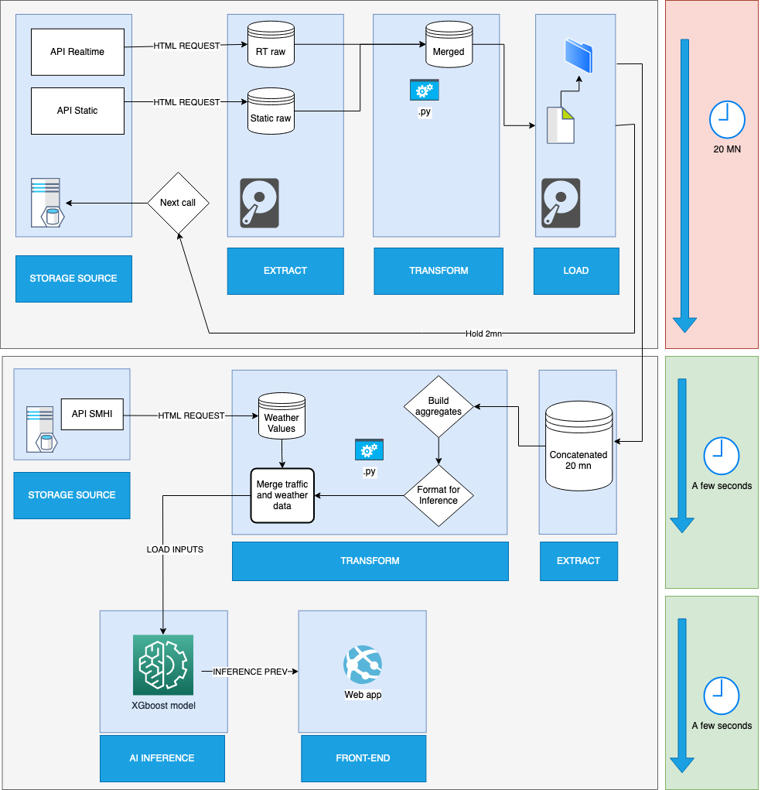
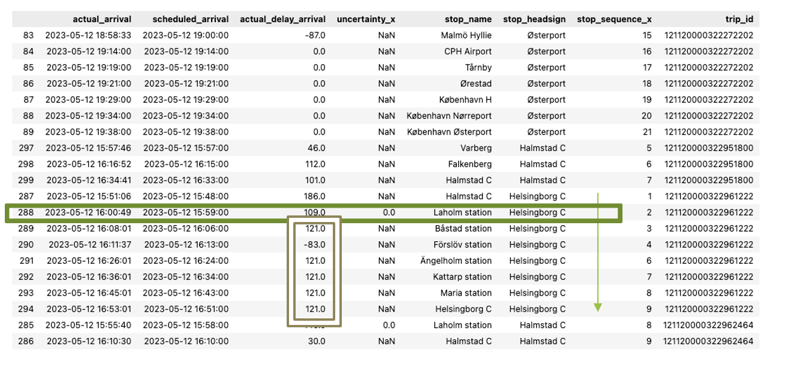
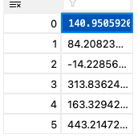

# A pipeline for real time ML inference over Trafiklab Data, managed by airflow. :station:

This repo is published from early development stage, and the main goal is to port the pipeline exposed in the following schema using Airflow, Docker, and a Ubuntu vm hosted on Azure.

As airflow is python based, this project will indeed be mainly python based!

The Pipeline was developped locally for my examination work, and resulted in a functioning ML model for inference over realtime data for train delay prognostication in Sweden (Region Skåne).

When the pipeline will be set into production in a cloud based setup, the AI model for delay prognostication will be published for inference over an API.
A frontend app is also planned.

---

Following is a human-readable presentation of the Trafiklab streamed data, with the inbuilt predictions (linear) and my own. This day (05-12-2023), based on on the current traffic condition of the Network, and the 109 seconds delay at Laholm station, the model predicted that the train would have reached it's final destination, Laholm 443 seconds after planned arrival.

